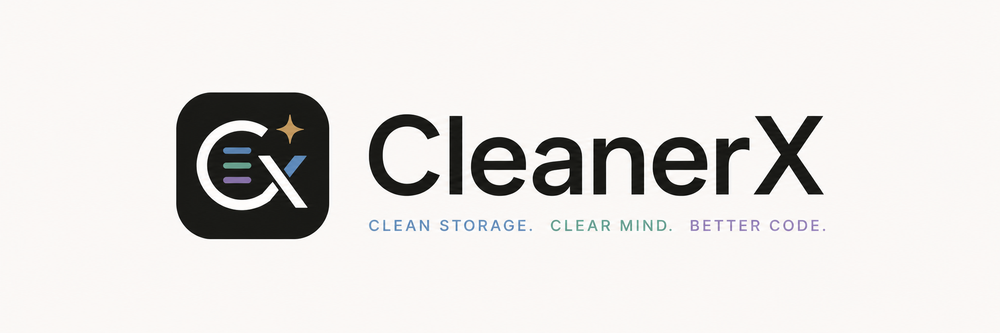

<p align="center">
  
</p>

# CleanerX

<p align="center">
  <strong>Review and safely clean private local data left by coding agents.</strong>
</p>

<p align="center">
  <a href="https://github.com/BeaCox/CleanerX/actions/workflows/ci.yml"></a>
  <a href="LICENSE"></a>
</p>

CleanerX is a local-only desktop application for inspecting and cleaning storage created by Codex, Claude Code, OpenCode, and pi. It presents a metadata-first inventory, expands the exact cleanup scope for review, and fails closed when an Agent capability, storage schema, path, or writer state cannot be verified.

CleanerX does not connect to cloud services, upload data, collect telemetry, or run in the background. A project path is grouping metadata only: CleanerX never recursively scans or modifies a source directory.

> [!CAUTION]
> CleanerX permanently deletes private local data. The repository is an engineering preview and does not yet provide a promoted binary release; current builds are unsigned. Nothing is selected automatically. Review every cleanup plan; if backup is unavailable or left off, deletion is irreversible.

## Why CleanerX

Coding agents can retain session histories, generated media, memories, logs, caches, and temporary files across many projects. Those data classes do not share one safe deletion rule: some have an official API, some use documented files, and some must remain read-only.

CleanerX gives them one review workflow without flattening those differences:

- inventory first, without retaining content bodies beyond one bounded pi display-title excerpt;
- group sessions by project while keeping source trees outside the cleanup boundary;
- block active, pinned, loaded, protected, or otherwise unsafe items;
- show descendants and dependent artifacts before confirmation;
- use an official Agent mutation route where one exists;
- offer encrypted backup only when a verified restore route exists; and
- rescan after cleanup or recovery instead of trusting journal state alone.

CleanerX is not a general disk cleaner, app uninstaller, project cleaner, or cloud-account deletion tool.

## Supported scope

Support is capability-gated at runtime. A listed Agent or platform does not guarantee that every installed version or data category is writable; unsupported and unrecognized operations remain visible where safe and degrade to read-only behavior.

| Agent | Inventory | Mutation route | Backup and restore |
| --- | --- | --- | --- |
| Codex | Sessions and descendants, memory, media, logs, caches, temporary data | App Server for session deletion and independently probed memory reset; guarded fixed-root routes for qualified local data | Not available for session or memory deletion because Codex exposes no supported import route |
| Claude Code | Sessions, project auto memory, history, caches, temporary data | Documented application-data paths with fixed-root validation and writer blocking | Encrypted backup for qualified restorable paths |
| OpenCode | Sessions and descendants, logs, cache | Official CLI while offline; verified loopback Server API for idle sessions while running | Official export/import for offline session backup and restore |
| pi | Sessions and fork lineage, provider catalog cache | Documented per-session file removal with fixed-root validation and writer blocking | Encrypted backup and restore for sessions |

The detailed routes, gates, limitations, and automated evidence live in the [mutation compatibility matrix](docs/compatibility.md).

| Platform | Current boundary | Build output |
| --- | --- | --- |
| macOS 13+ | Apple Silicon and Intel | Unsigned `.app` and DMG |
| Linux x86_64 | WebKitGTK 4.1 desktop environment; CI uses Ubuntu 22.04 | Unsigned `.deb` and AppImage |
| Windows 10/11 x86_64 | WebView2 Runtime; MSVC C runtime is statically linked | Unsigned MSI and NSIS installers |

There is no promoted binary release yet. The release workflow can produce explicitly unsigned artifacts from a reviewed `v*` tag; see the [release policy](docs/open-source-release-plan.md) for the gates that separate source availability from supported cleanup builds.

## Safety model

CleanerX treats deletion as a security boundary:

| Boundary | Guarantee |
| --- | --- |
| Projects and source | Project paths only organize Agent records. They are never recursive scan or cleanup roots. |
| Protected data | Authentication, configuration, MCP credentials, rules, skills, plugins, browser accounts, cookies, and source code are never cleanup targets. |
| Paths | Direct operations must remain beneath category-specific fixed roots. Traversal, links or redirects, ownership anomalies, mount/volume changes, protected descendants, and file identity changes are rejected. |
| Agent state | Active writers are explained and blocked. CleanerX never force-quits an Agent. |
| Official state | Codex and OpenCode session state is mutated only through supported public routes. CleanerX never repairs or deletes sessions through private SQLite writes. |
| Backup | Backup is optional and off by default. When selected, the encrypted archive is atomically committed, reopened, and hash-verified before mutation begins. |
| Restore | Every destination and manifest hash is preflighted before the first move. Restore never overwrites an existing ID or path and is all-or-nothing. |
| Recovery | A journal records mutation boundaries, but startup recovery always rescans the owning Agent before deciding whether an operation completed. |
| Privacy | No telemetry, crash upload, cloud sync, updater, background daemon, or unrestricted shell/filesystem API is included. |

Backups use tar + zstd and [age](https://age-encryption.org/) X25519 encryption. The private identity stays in macOS Keychain, Linux Secret Service, or Windows Credential Manager. If the native credential store is unavailable, backup creation fails before cleanup begins.

For the normative threat model and private reporting process, read [SECURITY.md](SECURITY.md).

## Build from source

### Prerequisites

- [Rust](https://www.rust-lang.org/tools/install) 1.88 or later
- [Node.js](https://nodejs.org/) 22 or later; CI uses Node.js 24
- [pnpm](https://pnpm.io/installation) 11.3.0 or later
- platform build tools: Xcode Command Line Tools on macOS, WebKitGTK/Tauri packages on Linux, or Microsoft C++ Build Tools plus WebView2 on Windows
- a supported local Agent installation or recognized data root for the inventory you want to inspect

On macOS, install the command-line tools if needed:

```bash
xcode-select --install
```

On Debian or Ubuntu, install the native dependencies:

```bash
sudo apt update
sudo apt install libwebkit2gtk-4.1-dev build-essential curl wget file \
  libxdo-dev libssl-dev libayatana-appindicator3-dev librsvg2-dev patchelf
```

Encrypted backup on Linux also needs a desktop Secret Service provider such as GNOME Keyring or KDE Wallet.

### Run the development app

```bash
make setup
make dev
```

Run the complete validation gate before submitting a change:

```bash
make check
```

### Build a native package

| Command | Host and result |
| --- | --- |
| `make app` | macOS: unsigned `.app` |
| `make bundles` | macOS: unsigned `.app` and DMG |
| `make linux` | Linux x86_64: unsigned `.deb` and AppImage |
| `make windows` | Windows x86_64 Developer PowerShell: unsigned MSI and NSIS installers |

Use `TARGET=<rust-target-triple>` with bundle commands when selecting an explicit architecture. Native packages are written beneath `target/release/bundle/`.

Unsigned builds may trigger Gatekeeper or SmartScreen. Verify that the binary came from the expected commit before approving it. Do not disable platform protections globally or trust a checksum as proof of publisher identity.

## Use CleanerX

1. Launch CleanerX, select a detected Agent, and scan.
2. Inspect the overview, sessions, media, memory, logs, caches, and temporary data available for that Agent.
3. Select individual eligible items or use selection within the current visible scope. Nothing is selected by default.
4. Review the expanded cleanup plan, including descendants, dependent artifacts, and blockers.
5. Choose whether to create an encrypted backup when the complete plan has a supported restore route. Backup is off by default.
6. Confirm cleanup. CleanerX executes the qualified route and rescans to verify the result.

Custom Agent data roots must be absolute and are saved in Settings. The defaults are:

| Agent | Resolution order |
| --- | --- |
| Codex | Settings override → `CODEX_HOME` → `~/.codex` |
| Claude Code | Settings override → `CLAUDE_CONFIG_DIR` → `~/.claude` |
| OpenCode | Settings override → `XDG_DATA_HOME/opencode` → `~/.local/share/opencode` |
| pi | Settings override → `PI_CODING_AGENT_DIR` → `~/.pi/agent` |

On Windows, `~` means `%USERPROFILE%`.

## When an operation is read-only

Read-only mode is a safety result, not a partial deletion attempt. CleanerX shows the specific missing capability, unrecognized schema, unsafe path, or active-writer blocker.

1. Read the reason in CleanerX and use **Retry connection** after resolving it.
2. Let the affected Agent finish writing, then close it normally; CleanerX will not force-quit it.
3. Confirm the Agent executable and configured data root. For Codex CLI installations, `codex --version` and `codex app-server --help` should succeed.
4. Upgrade the Agent if the installed version lacks the required public route, then rescan.

CleanerX will not turn an unsupported operation into a private database write or an unrestricted file deletion.

## Architecture

| Path | Responsibility |
| --- | --- |
| `crates/cleanerx-core` | Domain types, cleanup planning, path validation, backup/restore, hashing, and transaction invariants |
| `crates/adapter-codex` | Codex discovery, App Server transport and capability probing, storage classification, and read-only fallbacks |
| `crates/adapter-claude` | Claude Code discovery, documented storage classification, bounded previews, and guarded path cleanup |
| `crates/adapter-opencode` | OpenCode discovery, recognized-SQLite read-only inventory, and official CLI/Server mutation routes |
| `crates/adapter-pi` | pi discovery, documented session inventory and deletion, fork lineage, and protected-path classification |
| `src-tauri` | Narrow Tauri command boundary and cleanup transaction orchestration |
| `src` | React/TypeScript presentation and interaction |

Future Agents implement the compile-time `AgentAdapter` trait. CleanerX does not load a dynamic cleanup-plugin ABI or expose general shell and filesystem access to the webview.

CleanerX follows the public [Codex App Server protocol](https://learn.chatgpt.com/docs/app-server) for session operations and validates Windows behavior against the documented [Codex Windows execution model](https://learn.chatgpt.com/docs/windows/windows-app). Runtime capabilities are negotiated because Agents evolve independently of CleanerX.

## Documentation

Start with the [documentation index](docs/README.md). The main references are:

- [Mutation compatibility matrix](docs/compatibility.md)
- [Storage and transaction model](docs/storage-model.md)
- [Agent session hierarchy](docs/agent-session-hierarchy.md)
- [Agent memory model](docs/memory-management.md)
- [Development roadmap](docs/roadmap.md)
- [Open-source release policy](docs/open-source-release-plan.md)
- [Security policy](SECURITY.md)

## Contributing and support

Contributions are welcome. Read [CONTRIBUTING.md](CONTRIBUTING.md) and the repository-wide [AGENTS.md](AGENTS.md) constraints before starting. Public issues must contain sanitized metadata only; possible protected-data mutation, path escape, credential exposure, or backup/restore compromise belongs in a [private security advisory](https://github.com/BeaCox/CleanerX/security/advisories/new).

## Related projects and scope

CleanerX benefits from the documentation and interaction patterns established by mature local cleanup tools such as [BleachBit](https://github.com/bleachbit/bleachbit), [Czkawka/Krokiet](https://github.com/qarmin/czkawka), [Pearcleaner](https://github.com/alienator88/Pearcleaner), and [Bulk Crap Uninstaller](https://github.com/Klocman/Bulk-Crap-Uninstaller). Those projects serve broader disk, duplicate-file, application, or package-cleanup use cases. CleanerX does not reuse their cleaner definitions and deliberately stays limited to recognized coding-agent storage.

## License

Copyright © 2026 BeaCox. Licensed under the [Apache License 2.0](LICENSE).
